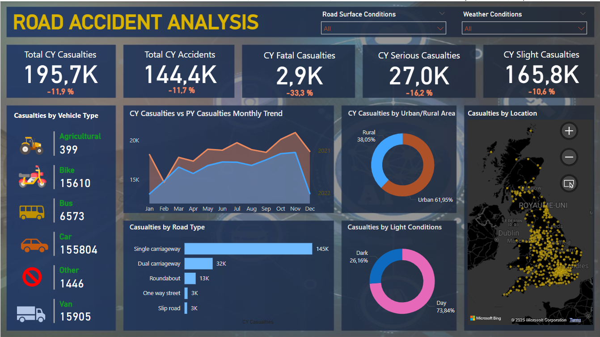

# RoadAccidentsDashboard
# 🚗 Road Accidents Analysis – Power BI Dashboard

Ce projet Power BI propose une **analyse approfondie des accidents de la route** à travers différents axes statistiques et géographiques.

## 🖼️ Aperçu du Dashboard

Le dashboard inclut :
- Le nombre total d’accidents et de victimes
- Une comparaison mensuelle avec l’année précédente
- Une cartographie des accidents au Royaume-Uni
- Une ventilation selon :
  - Le type de véhicule
  - Le type de route
  - Les conditions de lumière (jour/nuit)
  - La zone géographique (urbaine/rurale)

## 📊 Objectif du Projet

L'objectif principal est de :
- Visualiser les **tendances d'accidents** par mois et par type
- Identifier les **zones à risque**
- Comprendre les **facteurs contribuant** aux accidents pour soutenir les politiques de sécurité routière

---

## 🧾 Fichier inclus

- `Dashbord_RoadACCIDENTSANALYSIS.pbix` → Ouvrir avec Power BI Desktop

## 📦 Données

- Source : [à préciser, ex. UK Government Road Safety Data]
- Données nettoyées, modélisées, et visualisées dans Power BI

